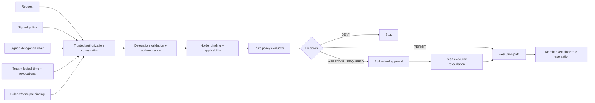

# NEST AuthZ

NEST AuthZ is an experimental Python library for deterministic authorization of
autonomous-agent actions using attenuated delegation, trusted policy artifacts,
explicit approval, and replay-correlatable evidence.

## The problem

Authenticating an agent answers “who presented this request?” It does not
answer whether that subject may perform this action on this resource, within
which delegated bounds, under which policy, with whose approval, or whether the
same execution permit was already used.

NEST AuthZ keeps those questions separate. It models authority provenance,
scope applicability, holder binding, policy evaluation, approval, current-state
revalidation, and local execution reservation as explicit deterministic steps.

Status: **experimental / research, proposed v0.1.0 Alpha**. This project is not
described as production-ready.

## Core invariants

- Default deny: no match, missing required input, or indeterminate applicable
  rule cannot permit.
- Authentication is not authorization; opaque request context cannot stand in
  for validated authority.
- Delegation may preserve or narrow scope, never amplify it.
- Policy and approval cannot widen, create, or resurrect authority.
- The request subject must be explicitly bound to the effective authority
  grantee.
- Decisions, approvals, and execution permits bind to canonical content
  digests of the exact security semantics.
- Signature validity is insufficient without explicit key trust, purpose,
  artifact kind, root trust, and signer/grantor agreement.
- One exact execution permit maps to one durable logical execution in the
  SQLite reference adapter.

The complete, reviewable list is in
[docs/security-invariants.md](docs/security-invariants.md).

## Architecture



The semantic core has no framework, HTTP, database, clock, environment,
network, randomness, or mutable global trust dependency. SQLite and Nanda Town
live behind adapters. See [docs/architecture.md](docs/architecture.md).

## Authorization pipeline

1. `verify_policy_bundle()` authenticates a policy artifact against a
   purpose-scoped `TrustStore`.
2. `authenticate_delegation_chain()` composes structural validation,
   attenuation, logical validity, revocation, grant signatures, root trust, and
   principal/key binding.
3. `authorize_trusted()` enforces request-holder binding and authority scope,
   then calls the pure deny-overrides evaluator.
4. An `APPROVAL_REQUIRED` decision becomes an exact `DecisionReceipt` and
   `PendingApproval`; only explicitly allowed principals can transition each
   requirement.
5. `revalidate_trusted_for_execution()` recomputes current security gates and
   can produce a factory-protected `ExecutionPermit`.
6. `SQLiteExecutionStore.reserve()` atomically returns `NEW_RESERVATION` once
   for that exact permit. Other results do not authorize a new execution.

The low-level `evaluate()` function remains public for pure semantic evaluation
and testing. It is not the trusted-artifact entrypoint.

## Minimal semantic example

```python
from nest_authz import (
    Action,
    AuthorityGrant,
    AuthorityScope,
    AuthorizationRequest,
    AuthorizationState,
    Condition,
    ConditionOperator,
    DelegationChain,
    FieldNamespace,
    FieldReference,
    Outcome,
    Policy,
    PolicyBundle,
    Principal,
    RequestContext,
    Resource,
    Rule,
    RuleEffect,
    Subject,
    SubjectPrincipalBinding,
    evaluate,
    validate_authority,
)

request = AuthorizationRequest(
    Subject("agent:payment"),
    Action("payments.transfer"),
    Resource("account:alice"),
    RequestContext({"amount": 700}),
    None,
)
grant = AuthorityGrant(
    "grant:payment",
    Principal("principal:alice"),
    Principal("principal:payment"),
    AuthorityScope(request.action, request.resource, {"amount": 1000}),
    None,
    0,
    200,
)
authority = validate_authority(
    DelegationChain((grant,)), AuthorizationState(logical_time=100)
).verified_authority
binding = SubjectPrincipalBinding(request.subject, Principal("principal:payment"))
condition = Condition(
    "action-is-transfer",
    FieldReference(FieldNamespace.ACTION, "name"),
    ConditionOperator.EQUALS,
    "payments.transfer",
)
bundle = PolicyBundle(
    (
        Policy(
            "policy:payments",
            (Rule("rule:permit", RuleEffect.PERMIT, (condition,)),),
        ),
    )
)

decision = evaluate(request, bundle, authority, binding)
assert decision.outcome is Outcome.PERMIT
```

This example demonstrates low-level semantics only. It intentionally omits the
artifact-authentication steps required by the trusted flow.

## Nanda Town demo

The optional Tier-1 offline scenario exercises a signed Alice → Finance Agent
→ Payment Subagent delegation and proves:

- amount 700 is permitted;
- amount 4000 exceeds subagent authority and is denied;
- a larger Finance Agent request requires approval;
- Mallory cannot approve it;
- revocation after approval blocks execution; and
- replaying one permit creates no second logical execution.

Start at [docs/nandatown-demo.md](docs/nandatown-demo.md). The integration uses
public deterministic TEST-ONLY fixture keys that must never be reused
operationally.

## Demonstrated security properties

The test suite demonstrates deterministic canonical identities across
processes, exact scalar typing (`True` is not `1`), fail-closed conditions,
non-amplifying multi-hop authority, purpose-separated Ed25519 attestations,
signer/grantor agreement, receipt-bound approvals, fresh execution
revalidation, and concurrent SQLite duplicate prevention.

See the [release evidence index](docs/release-evidence.md) and
[threat model](docs/threat-model.md) for claim-to-test mapping.

## Explicit limitations

NEST AuthZ v1 does **not** provide production PKI, DID/JWT authentication, key
rotation, global revocation distribution, distributed consensus, Byzantine
security, exactly-once external execution, or a complete IAM replacement.
Caller-supplied bindings, trust configuration, logical time, and revocation
state remain trusted inputs. A compromised process, `TrustStore`, or SQLite
file is outside the protection boundary. Obligations are represented but not
executed.

## Evidence and quality gates

The repository uses Python `unittest`, Ruff, mypy, line/branch coverage,
`pip-audit`, wheel/sdist build checks, and artifact-content inspection. CI tests
supported Python versions without secrets. Exact release-candidate results are
recorded in [docs/release-evidence.md](docs/release-evidence.md).

## Repository map

```text
src/nest_authz/
  domain.py                    immutable records and construction invariants
  canonical.py                 canonical bytes and typed SHA-256 identity
  delegation.py               structural/time/revocation validation
  attestation.py              Ed25519 detached artifact attestations
  authenticated_delegation.py signer/grantor/root authentication
  evaluator.py                low-level deterministic policy semantics
  approval.py, execution.py   approval and fresh execution revalidation
  trusted.py                  trusted-artifact orchestration
  sqlite_execution_store.py   local durable execution adapter
  integrations/nandatown/     optional simulator adapter, plugin, and scenario
tests/                         focused and adversarial tests
docs/                          architecture, threat model, ADRs, demo, evidence
benchmarks/                    informational reproducible microbenchmark
scripts/                       source and release-artifact checks
```

## Development setup

Use a dedicated virtual environment; do not use a shared Anaconda environment.
An unrelated `pyOpenSSL`/`cryptography` conflict was observed in the shared
environment and is not representative of this package.

```bash
python -m venv .venv
# POSIX: source .venv/bin/activate
# PowerShell: .venv\Scripts\Activate.ps1
python -m pip install --upgrade pip
python -m pip install -e ".[dev]"
python -m unittest discover -s tests -v
python -m ruff check .
python -m ruff format --check .
python -m mypy
```

Tests import the installed package; they do not modify `sys.path`. For Nanda
Town, follow the adjacent-checkout instructions in the demo document.

## Review documents

- [Architecture](docs/architecture.md)
- [Security model](docs/security-model.md)
- [Threat model](docs/threat-model.md)
- [Security invariants](docs/security-invariants.md)
- [Failure modes](docs/failure-modes.md)
- [Operability contract](docs/operability.md)
- [Nanda Town demo](docs/nandatown-demo.md)
- [Release evidence](docs/release-evidence.md)
- [Architecture decision records](docs/adr/)
- [Security reporting](SECURITY.md)
- [Contributing](CONTRIBUTING.md)
