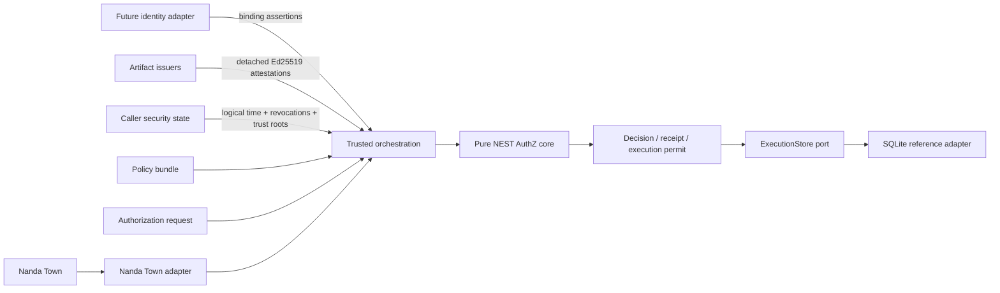
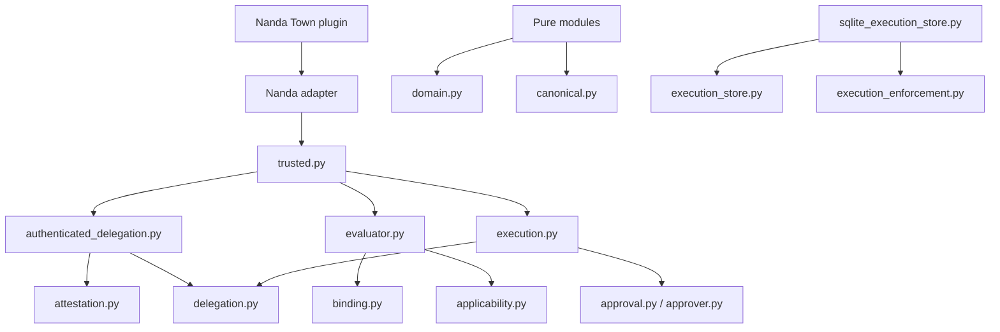
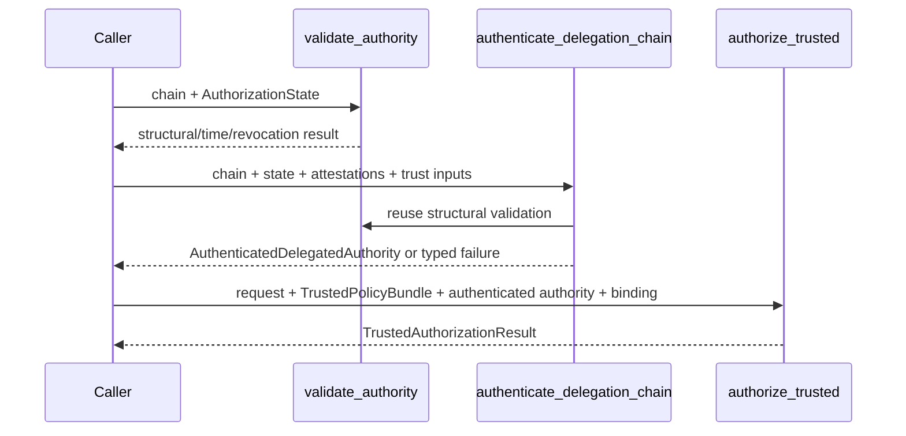
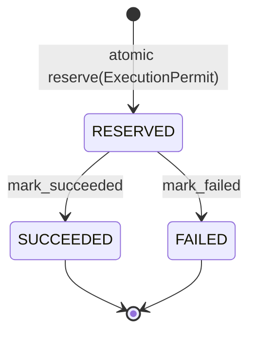

# NEST AuthZ architecture

## System context

NEST AuthZ is a deterministic authorization library. Callers supply the
request, policy, trust configuration, delegation artifacts, logical time, and
revocation state. The core reads no ambient clock, network, filesystem,
database, environment, or mutable global trust registry.

## Trust boundaries

1. **Identity boundary.** `SubjectPrincipalBinding` and approver bindings are
   trusted assertions supplied by a future authentication adapter. The core
   checks consistency, not origin authenticity.
2. **Artifact boundary.** Detached attestations are verified against an
   explicit `TrustStore`, artifact kind, and purpose. Trust configuration is
   caller-supplied security state.
3. **Authority-state boundary.** Logical time and revocations are explicit
   `AuthorizationState` input. The core validates against them but does not
   prove freshness or global completeness.
4. **Persistence boundary.** Pure code depends on the `ExecutionStore`
   protocol. Only the SQLite adapter reads or writes durable state.
5. **Simulator boundary.** The Nanda Town adapter translates simulator facts;
   the core neither imports nor depends on Nanda Town.

## Components and dependency direction

The pure core is `domain`, `canonical`, `delegation`, `applicability`,
`binding`, `evaluator`, `receipt`, `approver`, `approval`, `attestation`,
`authenticated_delegation`, `execution`, `execution_enforcement`, and
`trusted`. Infrastructure is isolated in `sqlite_execution_store` and
`integrations/nandatown`.

## Trusted computing base

The v1 trusted computing base includes:

- Python and the standard library;
- `cryptography`'s Ed25519 implementation;
- the NEST AuthZ domain, canonical encoder, validators, evaluator, and trusted
  orchestration code;
- caller-supplied `TrustStore`, principal/key registry, root principals,
  identity bindings, logical time, and revocation set; and
- for local single-use enforcement, SQLite plus local process/filesystem
  integrity.

Nanda Town is part of the demo environment, not the core TCB of applications
that do not install the integration.

## Policy evaluation flow

`evaluate()` is the low-level deterministic semantic engine. It evaluates
every condition through closed direct-field resolution, aggregates each rule as
`MATCHED`, `NOT_MATCHED`, or `INDETERMINATE`, fails closed on any relevant
indeterminate result, and combines matching effects as:

`DENY > APPROVAL_REQUIRED > PERMIT > no match (DENY)`.

Rule and policy order are non-semantic. A non-deny decision additionally
requires successful holder binding and applicable validated authority.

## Delegated-authority flow

Attenuation requires exact action and resource equality. Every parent numeric
bound must remain present and the child bound must be less than or equal to it;
children may add further upper bounds. Every grant is checked at
`valid_from <= logical_time < valid_until`.

## Approval and execution-revalidation flow

An `APPROVAL_REQUIRED` decision becomes a `DecisionReceipt`, then a
receipt-bound `PendingApproval`. Each requirement changes through a pure state
transition only with successful exact-principal approver authorization.

Before execution, `revalidate_trusted_for_execution()` authenticates the
current delegation again and recomputes holder binding, applicability, and the
policy decision. A successful result creates a factory-protected
`ExecutionPermit`. Logical time may advance, but request, policy, delegation,
and approval semantics must still match and authority must remain current.

## Execution enforcement flow

`ExecutionId` is the exact typed SHA-256 digest of the permit. SQLite uses a
primary key and unique permit-digest constraint inside `BEGIN IMMEDIATE`; only
`NEW_RESERVATION` authorizes the caller to begin the protected operation.
`RESERVED` surviving a crash is deliberate. The adapter cannot atomically
coordinate an external side effect with its local status update.

## Nanda Town boundary

The optional plugin implements Nanda Town's actual auth-layer methods
`sign_as(name, payload)` and
`verify(claimed_name, payload, signature, subject="")`. It delegates message
authentication to Nanda's reference HMAC plugin, then translates tagged
scenario operations to NEST AuthZ objects. Scenario YAML names the plugin file;
Nanda Town imports it through `plugin_files`, and decorators register the auth
plugin and validators. Authorization evidence is emitted with Nanda's
`engine.emit()` trace mechanism.

The simulator has a random run identifier and evaluation timestamp, so the
integration compares authorization-relevant trace semantics after excluding
`run_id`; the authorization behavior is deterministic for seeds 42, 7, and
1337.

## Public entrypoints

- Content identity: `canonical_bytes`, `sha256_digest`.
- Low-level semantics: `validate_authority`, `check_subject_authority_binding`,
  `check_authority_applicability`, `evaluate`.
- Artifact trust: `sign_artifact`, `verify_artifact`, `verify_policy_bundle`,
  `authenticate_delegation_chain`.
- Trusted authorization: `authorize_trusted`,
  `revalidate_trusted_for_execution`.
- Approval: `create_decision_receipt`, `create_pending_approval`,
  `check_approver_authorization`, and the transition functions.
- Execution enforcement: `execution_id_for`, `ExecutionStore`, and
  `SQLiteExecutionStore`.

See the ADRs for the exact canonical schemas and security semantics.
